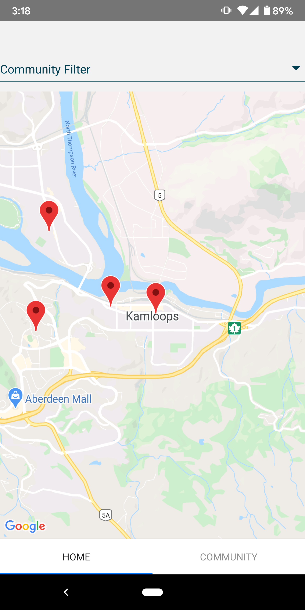

# UI Design

### Initial UI Design

For our first prototype, we decided to revolve our UI elements around the main focus of the app, which is the Deep Map itself. In order to save on development time and get a first iteration to our client as soon as possible, we opted to simply display the map of the DeepMap webpage as a WebView, simply displaying the Deep Map as it currently is on the DeepMap Webpage. While not entirely functional at this point in the project, we also included tabs at the bottom of the page for future pages to be added, such as a Community and Preferences page. We also included a filter at the top of the map, as one of our requirements is to allow for filtering by different communities.

### Second Iteration

In our second iteration, we implemented the MapView within React Native. This view takes advantage of the Google Maps API. We chose to create our own MapView rather than continue using a WebView to the DeepMap Webpage, as this would allow us to manipulate the markers on the map using our own database and do any further edits to map outside of using the Webpage.

### Final Iteration

Our Final Iteration of the app further polishes the look and feel of the app, taking advantage of scrolling tabs at the bottom of the screen. It also uses a Community tab to show Virtual Locations, community resources that don't have a specific location such as Facebook groups and websites. In addition, we created a Modal Pop-out page that displays a larger, more detailed view of each individual marker on the map. This modal is available on the Map as well as the Virtual Communities page.

# System Design / Architecture

Our system design / architecture is composed of three main parts. The first, and most obvious part of this architecture is the app itself. This part of the system simply displays the content of the system to the end users, and is the only user-facing part of the system. 

The second part of our architecture is our Firebase database itself. This NoSQL database is a simple database that has a unique child for each marker on the map. Under each marker, the database stores all relevant information for that marker, including the title, description, email, phone number and website of the location. In addition, it also includes a subtree of booleans, indicating what community each marker is a part of.

Finally, the last piece of this architecture is the client webpage. This webpage allows our client to directly manipulate the database in a very user-friendly interface. This hides the backend technical database from our client and ensures the integrity of the database, as the client webpage is very well structured to not "break" the underlying structure of the data in the database.

